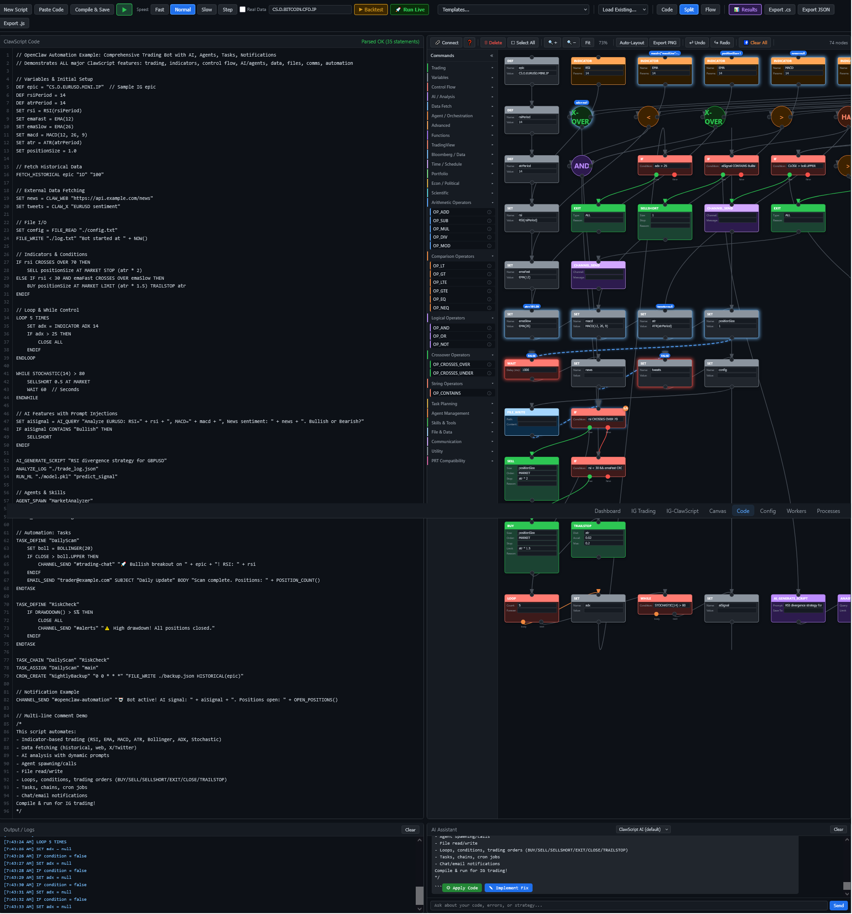
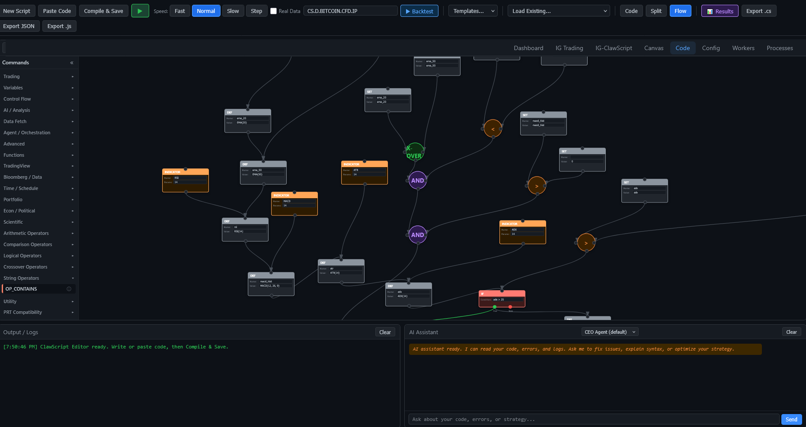
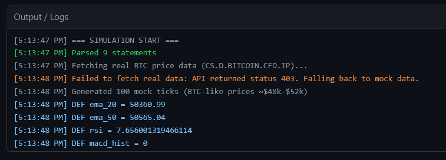

# ClawScript

A general-purpose domain-specific language (DSL) for automation, AI agent orchestration, neural computing, and application scripting in [OpenClaw](https://github.com/openclaw). Write readable commands that compile to JavaScript — from workflow automation and agent management to neural network control, data processing, and trading strategies.



## Features

- **120+ commands** across 20+ categories: Variables, Control Flow, AI/Analysis, Brain/Neural, Data Fetch, Agent Orchestration, Task Planning, Communication, Notifications, File & Data, Time/Schedule, Scientific, Functions, Trading, Portfolio, Economic/Political, TradingView-Style, Bloomberg/Data Access, PRT Compatibility (40+ ProRealTime commands), and more
- **Brain / Neural commands** — boot, stimulate, observe, and train spiking neural networks; create custom named brain instances with configurable neuron architectures; save and load brain weights; switch between multiple brains in scripts
- **21 Automation Commands** — define tasks, chain workflows, schedule cron jobs, send notifications via chat channels and email, read/write/execute files, and publish scripts
- **Notification Commands** — NOTIFY (browser notifications), TOAST (auto-dismiss overlays), POPUP (HTML modals), DISPLAY (formatted data tables/charts/JSON), TELEMETRY_START/LOG/STOP (real-time telemetry windows)
- **Visual Flow Builder** — drag-and-drop node editor with bidirectional code-to-flow synchronization, 20+ categories including Indicators (5 sub-categories) and Notifications
- **Operator Nodes** — round/circular operator nodes (Arithmetic, Comparison, Logical, Crossover, String) with multi-port I/O
- **Flow Toolbar** — Connect mode, Delete, Select All, Zoom In/Out/Fit, Auto-Layout, Export PNG, Undo/Redo, Clear All
- **Animated Flow Execution** — real-time node highlighting, glowing connection paths, live values on nodes, speed control (Fast/Normal/Slow/Step)
- **Command Info Icons** — info icons in sidebar showing floating documentation cards per command
- **Visual Output Popup** — draggable results modal with Simulation, Backtest, and Flow Trace tabs; equity curve canvas
- **Code Editor** — syntax-highlighted editor with live parsing, VS Code-style error highlighting with dynamic line height
- **Standalone Editor Page** — full editor accessible via "Code" link in top navigation bar
- **AI Assistant** — built-in chat panel with Bearer token auth, reads code/errors/logs to help fix issues
- **Strategy Compiler** — compiles `.cs` scripts to production-ready `.cjs` modules
- **Save & Deploy Pipeline** — save dialog with strategy name/filename, auto-deploy for engine discovery
- **Run Live** — config popup (name, instrument) then deploys as persistent background process with live log viewer, stop/restart/pause controls
- **Backtest** — config popup (timeframe, candle count, instrument) with progress indicator, results popup with equity curve canvas and trade list
- **Simulation & Backtest** — test strategies with real or cached data; green play button, instrument selector, multi-tier data fallback (API, DB cache, stream ticks, demo data)
- **Indicator Dropdown** — toolbar selector with 25+ indicators organized by category (Trend, Oscillators, Volatility, Volume), inserts code at cursor, favorites saved to localStorage
- **AI Integration** — query AI models, generate scripts, analyze logs, and scan sentiment
- **Agent Orchestration** — spawn agents, manage sessions, mutate configs at runtime
- **30+ Technical Indicators** — RSI, EMA, SMA, MACD, Bollinger Bands, ATR, ADX, Stochastic, CCI, Williams %R, ROC, Aroon, Ichimoku, Parabolic SAR, Keltner, Donchian, OBV, VWAP, CMF, ZScore, Supertrend, and more
- **Variable Tooltips** — `INPUT_*` declarations and `DEF` comments become editable fields and tooltips in bot dashboard
- **PRT Compatibility** — 40+ ProRealTime ProBuilder commands
- **Export** — `.cs` source, `.json` AST, `.js` compiled output, `.png` flow diagram
- **Single-Source Sync** — `sync-clawscript.sh` script keeps installer in sync with canonical sources
- **221 tests** — 82 parser + 139 pipeline tests, 100% pass rate

## Screenshots

### Code Editor + Flow Builder + AI Assistant


The editor combines a syntax-highlighted code pane (left), a visual flow builder (right), an Output/Logs panel (bottom-left), and an AI Assistant chat (bottom-right). The toolbar provides Compile & Save, speed controls, instrument selector, Backtest, and Run Live buttons.

### Visual Flow Builder


The flow view renders ClawScript as a directed graph. Rectangular nodes represent commands (trading, variables, control flow), circular nodes represent operators (AND, OR, comparisons, crossovers). The Commands sidebar organizes all blocks into collapsible categories.

### Simulation Output


Real-time simulation output showing parsed statement count, data fetching with automatic fallback, and live indicator computation (EMA, RSI, MACD).

## Quick Start

### Automation example

```clawscript
// Daily workflow: scan data, notify team, archive results
TASK_DEFINE "DataPipeline"
  SET report = CLAW_WEB "https://api.example.com/metrics"
  AI_QUERY "Summarize this data: " + report
  CHANNEL_SEND "#team" "Daily report ready"
  FILE_WRITE "./reports/daily.json" report
ENDTASK

CRON_CREATE "DailyPipeline" "0 9 * * *" "DataPipeline"
```

### Neural brain example

```clawscript
// Create and train a custom neural network
BRAIN_CREATE "pattern-detector" SENSORY 400 INTER 2400 MOTOR 600
BRAIN_USE "pattern-detector"
BRAIN_BOOT

// Stimulate with input data
BRAIN_STIMULATE { "price_up": 0.8, "volume": 0.5 }

// Read motor outputs
BRAIN_OBSERVE

// Reinforce good results
BRAIN_FEEDBACK "sugar"

// Save learned weights
BRAIN_SAVE
```

### Agent orchestration example

```clawscript
// Spawn specialized agents and coordinate tasks
SPAWN_AGENT "researcher" WITH "You are a research assistant"
SPAWN_AGENT "analyst" WITH "You are a data analyst"

SET data = AI_QUERY "Gather recent market sentiment"
AGENT_PASS data TO "analyst"

TASK_DEFINE "AnalysisChain"
  SET result = AGENT_CALL "analyst" "Analyze the data I received"
  CHANNEL_SEND "#results" result
ENDTASK

TASK_CHAIN "AnalysisChain"
```

### Trading strategy example

```clawscript
// RSI strategy with risk management
DEF rsi = RSI(14)

IF rsi < 30 THEN
  BUY 1 AT MARKET STOP 20 LIMIT 40 REASON "RSI oversold"
ENDIF

IF rsi > 70 THEN
  SELL 1 AT MARKET STOP 20 REASON "RSI overbought"
ENDIF
```

## Installation

### Into an existing OpenClaw instance

```bash
git clone https://github.com/JoeSzeles/clawscript.git
cd clawscript
bash install.sh
```

The installer copies files to the correct OpenClaw directories:

| What | Destination |
|------|-------------|
| Parser + indicators | `skills/bots/` |
| OpenClaw wrappers | `skills/bots/` |
| Strategy framework | `skills/bots/strategies/` |
| Editor UI + flow builder | `.openclaw/canvas/` |
| Templates | `.openclaw/canvas/clawscript-templates/` |
| Documentation | `.openclaw/canvas/` + `skills/clawscript/` |

Custom paths:
```bash
bash install.sh /path/to/.openclaw /path/to/skills
```

### Standalone usage (no OpenClaw)

```javascript
const { parseAndGenerate, parseToAST } = require('./lib/clawscript-parser.cjs');

// Parse to AST
const ast = parseToAST(`
  DEF rsi = RSI(14)
  IF rsi < 30 THEN
    BUY 1 AT MARKET STOP 20 REASON "dip buy"
  ENDIF
`);

// Compile to JavaScript module
const { js } = parseAndGenerate(code, 'MyStrategy');
```

## Project Structure

```
clawscript/
  lib/
    clawscript-parser.cjs    # Lexer, parser, AST builder, JS code generator
    clawscript-brain.cjs     # Brain/Neural runtime (brain engine HTTP client + custom brain spawning)
    indicators.cjs            # 25+ technical indicators (EMA, RSI, MACD, etc.)
    openclaw/                 # OpenClaw API wrapper stubs
      openclaw-ai.cjs         #   AI queries and ML
      openclaw-data.cjs       #   Web/PDF/video/image data fetch
      openclaw-chat.cjs       #   Chat and session management
      openclaw-tools.cjs      #   External tool execution
      openclaw-channels.cjs   #   Channel/alert management
      openclaw-nomad.cjs      #   Market scanning and allocation
      openclaw-automation.cjs #   Task, cron, file, email, channel automation
  editor/
    ig-clawscript-ui.js       # Code editor with syntax highlighting
    ig-clawscript-flow.js     # Visual flow builder (drag-drop node editor)
  strategies/
    base-strategy.cjs         # Base class all strategies extend
    index.cjs                 # Auto-discovery strategy loader
  templates/                  # Ready-to-use sample scripts
  examples/                   # Example compiled output
  docs/
    CLAWSCRIPT.md             # Full language reference (agent-readable)
    clawscript-docs.html      # Interactive documentation page
  screenshots/                # Editor and flow builder screenshots
  test/
    test-clawscript-parser.cjs  # 82-test suite
    test-clawscript-pipeline.cjs # 139-test pipeline suite
```

## Command Reference

### Brain / Neural
| Command | Description |
|---------|-------------|
| `BRAIN_BOOT` | Boot the neural engine — `BRAIN_BOOT [SENSORY <n>] [INTER <n>] [MOTOR <n>]` |
| `BRAIN_STATUS` | Get engine status (neurons, synapses, step count) |
| `BRAIN_STIMULATE` | Send inputs — `BRAIN_STIMULATE <inputs_json>` |
| `BRAIN_OBSERVE` | Read motor neuron output rates |
| `BRAIN_FEEDBACK` | Reinforce — `BRAIN_FEEDBACK "sugar"\|"pain" [WITH <data>]` |
| `BRAIN_TRAIN` | Toggle training — `BRAIN_TRAIN ON\|OFF [DIRECTION <dir>]` |
| `BRAIN_SAVE` | Save brain weights to disk |
| `BRAIN_LOAD` | Load brain weights from disk |
| `BRAIN_CREATE` | Create custom brain — `BRAIN_CREATE <name> [SENSORY <n>] [INTER <n>] [MOTOR <n>]` |
| `BRAIN_USE` | Switch brain — `BRAIN_USE <name>` or `BRAIN_USE "default"` |
| `BRAIN_LIST` | List all saved brain profiles |
| `BRAIN_DESTROY` | Remove brain — `BRAIN_DESTROY <name> [DELETE_WEIGHTS]` |

### Variables
| Command | Description |
|---------|-------------|
| `DEF` | Define constant — `DEF <name> = <expr>` |
| `SET` | Update variable — `SET <name> = <expr>` |
| `STORE_VAR` | Persist to storage — `STORE_VAR <key> <value>` |
| `LOAD_VAR` | Load from storage — `LOAD_VAR <key> [DEFAULT <val>]` |

### Control Flow
| Command | Description |
|---------|-------------|
| `IF` | Branch — `IF <cond> THEN ... [ELSE ...] ENDIF` |
| `LOOP` | Repeat — `LOOP <n> TIMES ... ENDLOOP` or `LOOP FOREVER ... ENDLOOP` |
| `WHILE` | Conditional loop — `WHILE <cond> ... ENDWHILE` |
| `TRY` | Error handling — `TRY ... CATCH <var> ... ENDTRY` |
| `WAIT` | Pause — `WAIT <ms>` |
| `ERROR` | Throw — `ERROR <message>` |

### AI / Analysis
| Command | Description |
|---------|-------------|
| `AI_QUERY` | Query AI — `AI_QUERY <prompt> [TOOL <name>] [ARG <val>]` |
| `AI_GENERATE_SCRIPT` | Auto-generate — `AI_GENERATE_SCRIPT <prompt> [TO <file>]` |
| `ANALYZE_LOG` | Analyze logs — `ANALYZE_LOG <query> [LIMIT <n>]` |
| `RUN_ML` | Run ML model — `RUN_ML <model> <data>` |
| `IMAGINE` | Generate AI image — `IMAGINE <prompt> [MODEL <name>]` |

### Data Fetch
| Command | Description |
|---------|-------------|
| `CLAW_WEB` | Fetch web — `CLAW_WEB <url> [INSTRUCT <str>]` |
| `CLAW_X` | Search X — `CLAW_X <query> [LIMIT <n>]` |
| `CLAW_PDF` | Extract PDF — `CLAW_PDF <file> [QUERY <str>]` |
| `CLAW_IMAGE` | Generate image — `CLAW_IMAGE <desc> [NUM <n>]` |
| `CLAW_VIDEO` | Analyze video — `CLAW_VIDEO <url>` |
| `CLAW_CONVERSATION` | Chat history — `CLAW_CONVERSATION <query>` |
| `CLAW_TOOL` | External tool — `CLAW_TOOL <toolName>` |
| `CLAW_CODE` | Execute code — `CLAW_CODE <code>` |

### Agent Orchestration
| Command | Description |
|---------|-------------|
| `SPAWN_AGENT` | Create agent — `SPAWN_AGENT <name> [WITH <prompt>]` |
| `CALL_SESSION` | Call session — `CALL_SESSION <agent> <command>` |
| `MUTATE_CONFIG` | Change config — `MUTATE_CONFIG <key> <value>` |
| `ALERT` | Send alert — `ALERT <message> [LEVEL <lvl>]` |
| `SAY_TO_SESSION` | Message session — `SAY_TO_SESSION <session> <message>` |
| `WAIT_FOR_REPLY` | Wait for reply — `WAIT_FOR_REPLY <session> [TIMEOUT <ms>]` |

### Task Planning & Automation
| Command | Description |
|---------|-------------|
| `TASK_DEFINE` | Define a task — `TASK_DEFINE <name> ... ENDTASK` |
| `TASK_ASSIGN` | Assign task to agent — `TASK_ASSIGN <task> <agent>` |
| `TASK_CHAIN` | Sequential tasks — `TASK_CHAIN <task1> <task2> [...]` |
| `TASK_PARALLEL` | Parallel tasks — `TASK_PARALLEL <task1> <task2> [...]` |
| `CRON_CREATE` | Create cron job — `CRON_CREATE <name> <schedule> <command>` |
| `CRON_CALL` | Trigger cron job — `CRON_CALL <name>` |
| `FILE_READ` | Read file — `FILE_READ <path>` |
| `FILE_WRITE` | Write file — `FILE_WRITE <path> <content>` |
| `FILE_EXECUTE` | Execute script — `FILE_EXECUTE <path>` |

### Communication
| Command | Description |
|---------|-------------|
| `CHANNEL_SEND` | Send to channel — `CHANNEL_SEND <channel> <message>` |
| `EMAIL_SEND` | Send email — `EMAIL_SEND <to> SUBJECT <subj> BODY <body>` |
| `PUBLISH_CANVAS` | Publish canvas page — `PUBLISH_CANVAS <name>` |

### Trading
| Command | Description |
|---------|-------------|
| `BUY` | Open long — `BUY <size> AT MARKET\|LIMIT\|STOP [STOP <dist>] [LIMIT <dist>] [REASON <str>]` |
| `SELL` | Open short / close long — same syntax as BUY |
| `SELLSHORT` | Explicit short — `SELLSHORT <size> [STOP <dist>] [REASON <str>]` |
| `EXIT` | Close position — `EXIT ALL\|PART [REASON <str>]` |
| `CLOSE` | Close current — `CLOSE [REASON <str>]` |
| `TRAILSTOP` | Trailing stop — `TRAILSTOP <dist> [ACCEL <val>] [MAX <val>]` |

### Advanced
| Command | Description |
|---------|-------------|
| `CRASH_SCAN` | Crash scanner — `CRASH_SCAN ON\|OFF` |
| `MARKET_NOMAD` | Nomadic scanning — `MARKET_NOMAD ON\|OFF` |
| `NOMAD_SCAN` | Scan instruments — `NOMAD_SCAN <category> [LIMIT <n>]` |
| `NOMAD_ALLOCATE` | Allocate — `NOMAD_ALLOCATE <target> [SIZING <mode>]` |
| `RUMOR_SCAN` | Scan rumors — `RUMOR_SCAN <topic> [SOURCES <list>]` |
| `OPTIMIZE` | Optimize param — `OPTIMIZE <var> FROM <min> TO <max> STEP <step>` |
| `INDICATOR` | Calculate — `INDICATOR <name> <params>` |

### Functions
| Command | Description |
|---------|-------------|
| `DEF_FUNC` | Define function — `DEF_FUNC <name>(<args>) ... ENDFUNC` |
| `CHAIN` | Chain operations — `CHAIN ... ENDCHAIN` |
| `INCLUDE` | Include script — `INCLUDE <script>` |

### TradingView-Style
| Command | Description |
|---------|-------------|
| `STRATEGY_ENTRY` | Pine Script-style entry — `STRATEGY_ENTRY <name> [DIRECTION <dir>] [STOP <dist>] [LIMIT <dist>]` |
| `STRATEGY_EXIT` | Pine Script-style exit — `STRATEGY_EXIT <name> [REASON <str>]` |
| `STRATEGY_CLOSE` | Close all positions — `STRATEGY_CLOSE [REASON <str>]` |
| `INPUT_INT` | Declare integer input — `INPUT_INT <name> [DEFAULT <val>]` |
| `INPUT_FLOAT` | Declare float input — `INPUT_FLOAT <name> [DEFAULT <val>]` |
| `INPUT_BOOL` | Declare boolean input — `INPUT_BOOL <name> [DEFAULT <val>]` |
| `INPUT_SYMBOL` | Declare symbol input — `INPUT_SYMBOL <name> [DEFAULT <val>]` |
| `ARRAY_NEW` / `ARRAY_PUSH` | Create and manipulate arrays |
| `MATRIX_NEW` / `MATRIX_SET` | Create and manipulate matrices |

### Bloomberg / Data Access
| Command | Description |
|---------|-------------|
| `FETCH_HISTORICAL` | BDH-style data — `FETCH_HISTORICAL <metric> [FROM <date>] [TO <date>]` |
| `FETCH_MEMBERS` | BDS-style members — `FETCH_MEMBERS <index>` |
| `ECON_DATA` | Economic data — `ECON_DATA <metric> [COUNTRY <code>]` |
| `ESTIMATE` | Consensus estimate — `ESTIMATE <field> <ticker>` |

### Time / Schedule
| Command | Description |
|---------|-------------|
| `TIME_IN_MARKET` | Time since position opened |
| `SCHEDULE` | Schedule task — `SCHEDULE <task> [AT <HH:MM>] [REPEAT <daily/weekly>]` |
| `WAIT_UNTIL` | Wait until condition — `WAIT_UNTIL <condition> [TIMEOUT <seconds>]` |
| `TASK_SCHEDULE` | Schedule recurring task |

### Portfolio
| Command | Description |
|---------|-------------|
| `MARKET_SCAN` | Scan markets — `MARKET_SCAN <category> [CRITERIA <expr>] [LIMIT <n>]` |
| `PORTFOLIO_BUILD` | Build portfolio — `PORTFOLIO_BUILD [FROM <scan>] [NUM <n>] [SIZING <mode>]` |
| `PORTFOLIO_REBALANCE` | Rebalance — `PORTFOLIO_REBALANCE [THRESHOLD <dd_pct>]` |

### Economic / Political
| Command | Description |
|---------|-------------|
| `ECON_INDICATOR` | GDP, CPI, unemployment — `ECON_INDICATOR <metric> [COUNTRY <code>]` |
| `FISCAL_FLOW` | Capital flows — `FISCAL_FLOW <asset> [WINDOW <period>]` |
| `ELECTION_IMPACT` | Election market impact — `ELECTION_IMPACT <event>` |
| `CURRENCY_CARRY` | Carry trade differential — `CURRENCY_CARRY <pair>` |
| `MONTE_CARLO` | Monte Carlo simulation — `MONTE_CARLO <scenario> [RUNS <n>]` |
| `RISK_MODEL` | VaR / ES risk — `RISK_MODEL <type> [CONFIDENCE <val>]` |

### PRT Compatibility (40+)
ProRealTime ProBuilder compatibility layer. All `PRT_` prefixed commands map to ClawScript equivalents:
`PRT_BUY`, `PRT_SELL`, `PRT_RSI`, `PRT_MACD`, `PRT_BOLLINGER`, `PRT_STOCHASTIC`, `PRT_ATR`, `PRT_CCI`, `PRT_ADX`, `PRT_DONCHIAN`, `PRT_ICHIMOKU`, `PRT_KELTNERCHANNEL`, `PRT_PARABOLICSAR`, `PRT_SUPERTREND`, `PRT_FIBONACCI`, `PRT_PIVOTPOINT`, `PRT_DEMARK`, `PRT_WILLIAMS`, `PRT_VWAP`, `PRT_CUM`, `PRT_HIGHEST`, `PRT_LOWEST`, `PRT_STD`, `PRT_CORRELATION`, `PRT_REGRESSION`, `PRT_CROSS`, `PRT_BARSSINCE`, and more.

## Operators

| Category | Operators |
|----------|-----------|
| Arithmetic | `+`, `-`, `*`, `/`, `%` |
| Comparison | `<`, `>`, `<=`, `>=`, `==`, `!=` |
| Logical | `AND`, `OR`, `NOT` |
| Crossover | `CROSSES OVER`, `CROSSES UNDER` |
| String | `CONTAINS` |

## Built-in Indicators

```clawscript
DEF rsi = RSI(14)
DEF ema = EMA(21)
DEF sma = SMA(50)
DEF atr = ATR(14)
DEF macd = MACD(12, 26, 9)
DEF bb_upper = BOLLINGER_UPPER(20, 2)
DEF bb_lower = BOLLINGER_LOWER(20, 2)
DEF price = LAST_PRICE()
DEF vol = VOLUME()
```

## Visual Flow Builder

The editor includes a drag-and-drop node editor that syncs bidirectionally with the code pane:

- **Toolbox sidebar** with 120+ command blocks organized in 20+ categories (including Brain/Neural, 5 Indicator sub-categories, and Notifications)
- **Drag nodes** onto the canvas — they snap to a grid
- **Connect ports** between nodes to define execution flow
- **Inline editing** of node parameters
- **Zoom/Pan** — scroll to zoom (zooms toward cursor), click+drag to pan
- **Auto-layout** arranges nodes in a smart grid (linear chains group into rows, branches spread horizontally)
- **Undo/Redo** with Ctrl+Z / Ctrl+Y (50-state stack)
- **Export PNG** of the flow diagram
- Changes in code update the flow, changes in flow update the code

## Save & Deploy Pipeline

ClawScript modules integrate directly with the OpenClaw engine:

1. **Write** — Create your script in the code editor or flow builder
2. **Compile & Save** — Opens a dialog with name and filename fields
3. **Deploy** — The compiled `.cjs` file is saved for engine discovery
4. **Discover** — The loader auto-registers the new module
5. **Configure** — `INPUT_*` variables appear as editable fields in the dashboard
6. **Run** — The engine calls `evaluateEntry()` / `evaluateExit()` on each tick

### Variable Tooltips

Comments on `DEF` and `INPUT_*` lines become tooltips in the editor:

```clawscript
DEF period = 14           // Lookback period (tooltip in editor)
INPUT_INT lookback DEFAULT 50   // Number of data points to analyze
INPUT_FLOAT threshold DEFAULT 0.02  // Sensitivity threshold
```

### API Endpoints

| Endpoint | Method | Description |
|----------|--------|-------------|
| `/api/clawscript/strategies` | GET | List ClawScript modules |
| `/api/clawscript/strategies` | POST | Save compiled module |
| `/api/clawscript/strategies/:name` | DELETE | Remove module |
| `/api/clawscript/templates` | GET | List templates |
| `/api/clawscript/templates/:name` | GET | Get template source |
| `/api/clawscript/backtest` | POST | Run backtest with historical data |

## Compiled Output

ClawScript compiles to a JavaScript class extending `BaseStrategy`:

```javascript
class MyModule extends BaseStrategy {
  async evaluateEntry(ticks, context) {
    // Your logic here
    return { signal: true, direction: 'BUY', size: 1, ... };
  }

  async evaluateExit(position, ticks, context) {
    return { close: false, reason: '' };
  }

  getConfigSchema() { /* UI config fields */ }
  static get STRATEGY_TYPE() { return 'custom-mymodule'; }
}
```

Place compiled `.cjs` files in `strategies/` — the auto-discovery loader picks them up automatically.

## AI Assistant

The editor includes a built-in AI assistant (right panel, next to Output/Logs):

- Automatically reads your current code, parse errors, and recent output logs
- Ask it to fix errors, explain syntax, optimize scripts, or suggest improvements
- Model selector: CEO Agent (default, routes to OpenClaw gateway) or Grok
- Full chat history with send on Enter

## Simulation & Backtest

- **Green play button** runs simulation with real or mock data
- **Instrument selector**: Set any instrument epic manually
- **Multi-tier data fallback**: REST API, DB-cached candles, in-memory stream ticks, mock data
- **Server-side backtest**: Full indicator computation with up to 2000 historical data points
- **Results**: P&L, win rate, max drawdown, individual trade list with timestamps

## Testing

```bash
npm test
# or
node test/test-clawscript-parser.cjs
```

221 tests total (82 parser + 139 pipeline) covering all commands, expressions, operators, edge cases, code generation, module integration, stub fallbacks, and data integration.

## Sample Templates

Seven complete templates are included in `templates/`:

1. **rsi-simple.cs** — Buy when RSI oversold, sell when overbought
2. **ema-crossover.cs** — EMA fast/slow crossover with trailing stop
3. **multi-indicator.cs** — RSI + MACD + Bollinger Bands with try/catch error handling
4. **sentiment-scan.cs** — AI sentiment analysis + market scanner
5. **btc-scalper.cs** — Fast BTC scalping with RSI + EMA and tight stops
6. **mean-reversion.cs** — Bollinger Band mean reversion with error handling
7. **bourse-trackers.cs** — Multi-indicator approach for major index CFDs

## License

MIT
